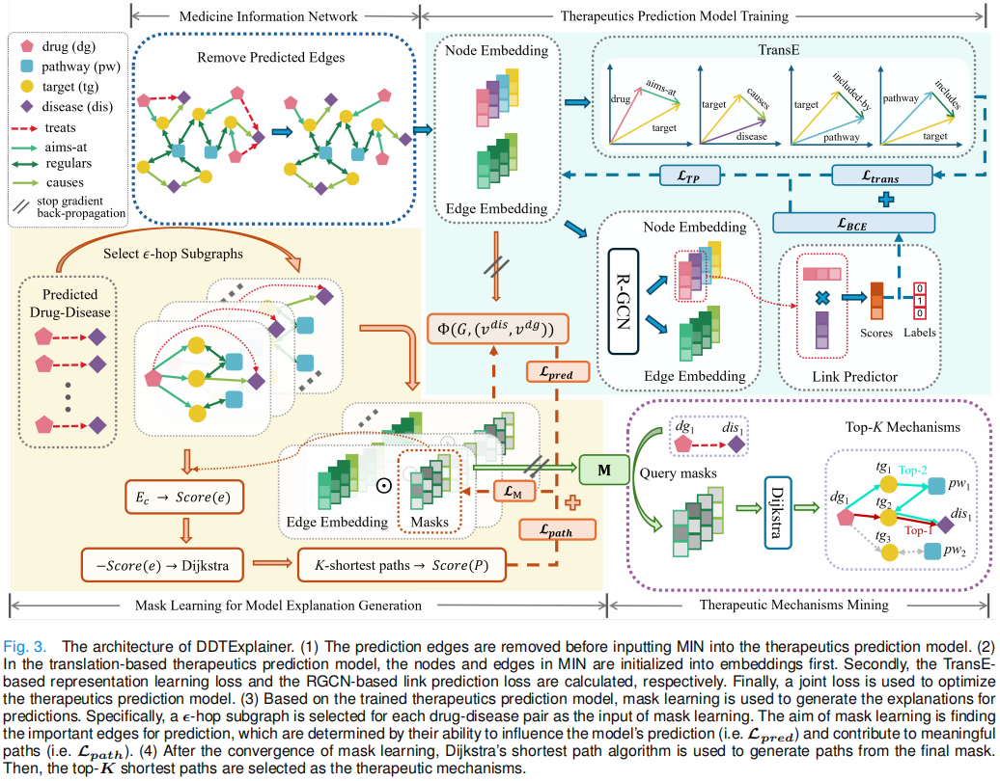

<!-- #region -->
# <ins>D</ins>rug-<ins>D</ins>isease <ins>T</ins>herapeutic Mechanisms <ins>Explainer</ins> (DDTExplainer)


### The overall architecture of DDTExplainer
<p align="center">
  <br />
  
  <br />
</p>

## Getting Started

### Requirements
- Please follow the links below to install PyTorch and DGL with proper CUDA versions
    - PyTorch https://pytorch.org/
    - DGL https://www.dgl.ai/pages/start.html

- Then install packages by running the line below
```bash
pip install -r requirements.txt
```

- Our code has been tested with
    - Python = 3.10.6
    - PyTorch = 1.12.1
    - DGL = 0.9.1


### Data
The integrated medicine information network data are under `data/`. 

To facilitate understanding of the results produced by methods, we provide the 'nodeID-Name' mapping files under `data/nodes`. 

### Datasets
The datasets used in the paper are under `datasets/`. The MIN_groundtruth is used to evaluate the method performance, and the MIN_case is used to evaluate the effectiveness of the method in the specific application. For details of the MIN, please refer to the paper.

For comparison, the citation dataset is after augmentaion, so edges of type `likes` have been added. Similarly for the synthetic dataset. For details of this two datasets, please refer to the paper [PaGE-Link: Path-based Graph Neural Network Explanation for Heterogeneous Link Prediction](https://dl.acm.org/doi/10.1145/3543507.3583511). 

You may also add your favourite datasets by modifying the `load_dataset` function in `dataset_processing.py`.

### GNN Model
We implement the `TransE` as the encorder module for `RGCN` model on MIN graph in `model.py`. A pre-trained model checkpoint is stored in `saved_models/`.


### Explainer Usage
- Run PaGE-Link to explain trained GNN models 
  - A simple example is shown below
  ```bash
    python code/DDTExplanier.py --dataset_name=MIN_groundtruth --save_explanation
  ```

  - Hyperparameters maybe specified in the `.yaml` file and pass to the script using the `--config_path` argument.
  ```bash
    python code/DDTExplanier.py --dataset_name=MIN_groundtruth --config_path=code/config.yaml --save_explanation
  ```

- Train new GNNs for explanation
  - Run `TransE_linkpred.py` as the examples below
    ```bash
    python code/TransE_linkpred.py --dataset_name=MIN_groundtruth --save_model --emb_dim=68 --hidden_dim=68 --out_dim=68
    ```
    --dataset_name=aug_citation --emb_dim=128 --hidden_dim=128 --out_dim=128
    --dataset_name=aug_citation --emb_dim=128 --hidden_dim=128 --out_dim=128

  - Run `RGCN_linkpred.py` as the examples below
    ```bash
    python code/baselines/RGCN_linkpred.py --dataset_name=MIN_groundtruth --save_model --emb_dim=68 --hidden_dim=68 --out_dim=68
    ```

- Run baselines 
    - A simple example is shown below, replace `method` with `gnnexplainer_link` or `pgexplainer_link`.
    ```bash
    python code/baselines/{method}.py --dataset_name=MIN_groundtruth --config_path=code/baselines/baseline_config.yaml --save_explanation
    ```


## Results

### Quantitative
- Evaluate saved DDTExplanier explanations
```bash
python code/eval_explanations.py --dataset_name=MIN_groundtruth --emb_dim=68 --hidden_dim=68 --out_dim=68 --eval_explainer_names=DDTExplanier
```

- Evaluate saved baselines explanations
```bash
python code/baselines/baseline_eval_explanations.py --dataset_name=MIN_groundtruth --emb_dim=68 --hidden_dim=68 --out_dim=68 --eval_explainer_names=['gnnexp','pgexp', 'pagelink']
```

**Note**: As exact reproducibility is not guaranteed with PyTorch even with identical random seed
(See https://pytorch.org/docs/stable/notes/randomness.html), the results may be slightly off from the paper.

### Qualitative
Example of path explanations output by PaGE-Link. Node information are showing on the right.
Top three paths (<span style="color:green">green arrows</span>) selected by PaGE-Link for explaining the predicted link (𝑎328, 𝑝5670) (<span style="color:red">dashed red</span>). The selected paths are short and do not go through a generic field of study like “Computer Science”.

<p align="center">
  <br />
  
  <br />
</p>


<!-- #endregion -->
